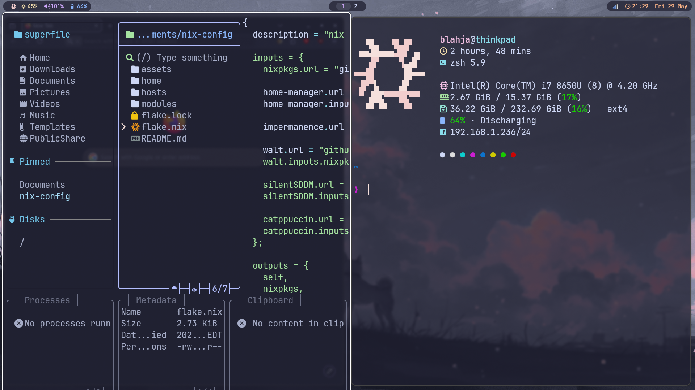
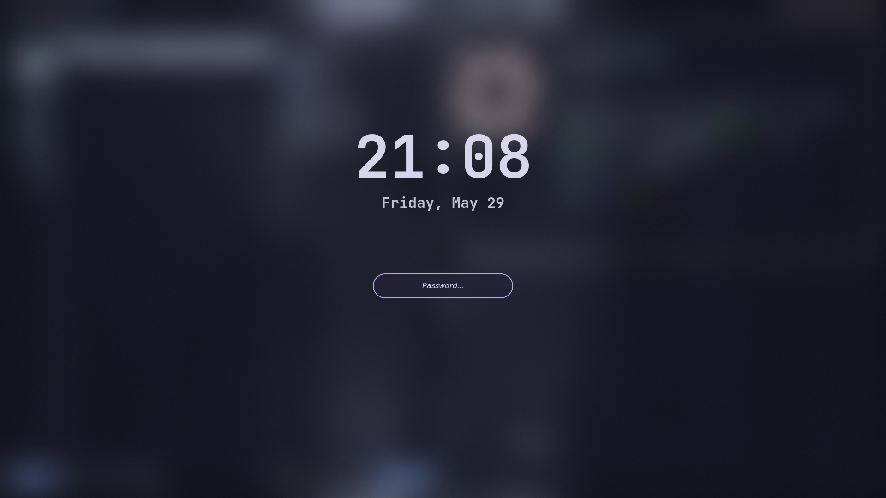
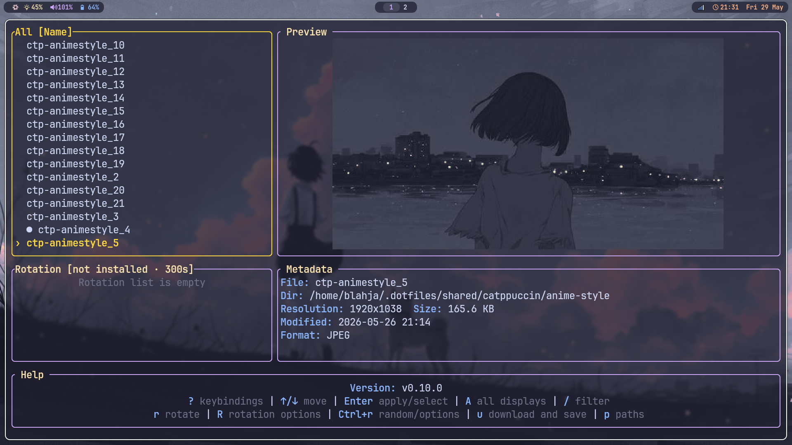

# My NixOS Config


Personal nix config built with [NixOS](https://nixos.org/) and [Home Manager](https://github.com/nix-community/home-manager).  flakes are for my **thinkpad** (Hyprland) and **homelab** (headless).


## Hosts


| Host       | role                              | default user | Hardware                         |                                           |
| ------------| -----------------------------------| --------------| ----------------------------------| ------------------------------------------------|
| `thinkpad` | Wayland desktop (SDDM & Hyprland) | `blahja`     | ThinkPad · i7-8650U · 16 GiB     | `sudo nixos-rebuild switch --flake .#thinkpad` |
| `homelab`  | Server                            | `root`       | OptiPlex 7040 · i7-6700 · 32 GiB | `sudo nixos-rebuild switch --flake .#homelab`  |


## Thinkpad


| features             | Tools                                                                                        |
| ------------------| ----------------------------------------------------------------------------------------------|
| Compositor       | [Hyprland](https://hyprland.org/), hypridle, hyprlock, hyprshot, wlogout                     |
| Bar & launcher   | [Waybar](https://github.com/Alexays/Waybar), [Rofi](https://github.com/davatorium/rofi)      |
| Terminal & files | [Kitty](https://sw.kovidgoyal.net/kitty/), [Superfile](https://github.com/yorukot/superfile) |
| Shell            | [Zsh](https://www.zsh.org/) (oh-my-zsh), fzf, fastfetch                                      |
| Editor           | [Neovim](https://neovim.io/)                                                                 |
| Notifications    | [Dunst](https://github.com/dunst-project/dunst)                                              |
| Wallpapers       | [Walt](https://github.com/gitfudge0/walt)                                                    |
| Look             | Catppuccin mocha for majority of theming                                                     |
| Dotfiles         | [blahajr/dotfiles](https://github.com/blahajr/dotfiles)                                      |


### Keybinds

keys are set inside of `home/profiles/desktop/hypr/keybinds.nix`.
default mod key is set to **Super** (`$mod`).

Keybinds


| Key                | Action                          |
| --------------------| ---------------------------------|
| `Super + Space`    | Rofi launcher                   |
| `Super + T`        | Kitty terminal                  |
| `Super + E`        | Superfile                       |
| `Super + D`        | Select wallpaper (Walt)         |
| `Super + Alt + D`  | Random wallpaper (Walt)         |
| `Super + B`        | Firefox                         |
| `Super + C`        | Clipboard history → Rofi → copy |
| `Super + Q`        | Close window                    |
| `Super + V`        | Toggle floating                 |
| `Super + F`        | Fullscreen                      |
| `Super + O`        | Hyprlock                        |
| `Super + H/J/K/L`  | Focus left / down / up / right  |
| `Super + LMB` drag | Move window                     |
| `Super + RMB` drag | Resize window                   |

## Screenshots

| Desktop                                 | Hyprlock                                     | Wallpaper picker                                      |
| -----------------------------------------| ----------------------------------------------| -------------------------------------------------------|
|  |  |  |

## Layout

```text
├── flake.lock
├── flake.nix
├── home
│   ├── profiles
│   │   ├── apps
│   │   │   ├── browser.nix
│   │   │   ├── default.nix
│   │   │   ├── media.nix
│   │   │   └── terminal.nix
│   │   ├── common
│   │   │   ├── default.nix
│   │   │   └── packages.nix
│   │   ├── desktop
│   │   │   ├── default.nix
│   │   │   ├── dunst.nix
│   │   │   ├── hypr
│   │   │   ├── rofi.nix
│   │   │   ├── superfile.nix
│   │   │   ├── theme
│   │   │   └── waybar
│   │   ├── dev
│   │   │   ├── default.nix
│   │   │   └── java.nix
│   │   └── gaming
│   │       ├── default.nix
│   │       ├── minecraft.nix
│   │       └── steam.nix
│   └── users
│       ├── blahja
│       │   ├── default.nix
│       │   ├── fastfetch.nix
│       │   ├── hosts
│       │   │   └── thinkpad.nix
│       │   └── shell.nix
│       └── root
│           └── default.nix
├── hosts
│   ├── homelab
│   │   ├── default.nix
│   │   ├── enabled
│   │   ├── hardware-configuration.nix
│   │   ├── identity.nix
│   │   ├── network.nix
│   │   └── system
│   │       ├── boot.nix
│   │       ├── default.nix
│   │       ├── docker.nix
│   │       ├── firewall.nix
│   │       └── services
│   └── thinkpad
│       ├── default.nix
│       ├── enabled
│       ├── hardware-configuration.nix
│       ├── identity.nix
│       ├── network.nix
│       └── system
│           ├── boot.nix
│           ├── default.nix
│           ├── desktop
│           └── laptop.nix
├── modules
│   ├── home-manager
│   │   ├── default.nix
│   │   ├── desktop-env.nix
│   │   └── dotfiles.nix
│   ├── settings.nix
│   └── system
│       ├── core.nix
│       ├── packages.nix
│       ├── security.nix
│       ├── ssh.nix
│       └── users.nix
└── README.md
```

